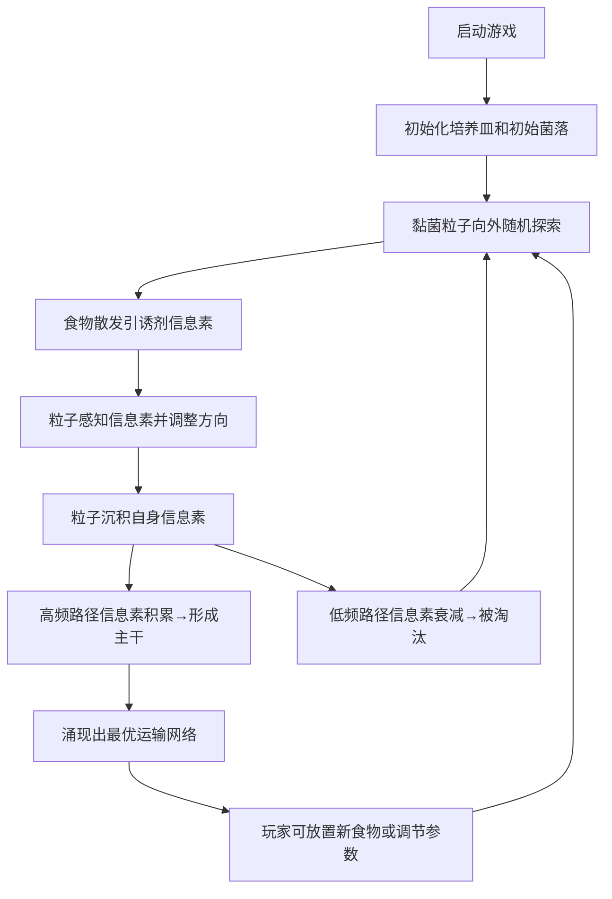

## 1. 产品概述
一个基于 Physarum 黏菌运输模型的涌现性智能模拟器。玩家操控黏菌在培养皿中寻找食物节点，通过原生质流动、脉动网络和信息素浓度自然涌现出最短路径，带来视觉奇观。
- 目标用户：算法爱好者、生物学爱好者、喜欢涌现性系统的玩家
- 产品价值：以游戏化方式展示群体智能、自组织系统的美感，同时提供沉浸式交互体验

## 2. 核心特性

### 2.1 功能模块
1. **主模拟器页面**：Canvas 培养皿、黏菌网络、食物节点、控制面板、参数调节面板

### 2.2 页面详情
| 页面名称 | 模块名称 | 功能描述 |
|-----------|-------------|---------------------|
| 主模拟器 | 培养皿 Canvas | 渲染黏菌网络、原生质流动效果、信息素可视化 |
| 主模拟器 | 黏菌物理引擎 | 基于 Physarum 模型的多智能体系统（粒子 + 信息素场） |
| 主模拟器 | 食物节点系统 | 食物散发引诱剂、被消耗后缩小、支持玩家放置 |
| 主模拟器 | 玩家控制系统 | 鼠标/触屏引导黏菌生长方向，调整探索/巩固参数 |
| 主模拟器 | 参数面板 | 调节感知角度、移动速度、信息素扩散/衰减、脉动频率等 |
| 主模拟器 | HUD 显示 | 显示食物收集数、网络规模、主干数量等实时指标 |

## 3. 核心流程
玩家打开页面后看到圆形培养皿，黏菌从中心初始菌落开始向外探索。玩家可以点击放置食物，食物散发出引诱剂信息素。黏菌粒子通过感知周围信息素浓度、转动方向、沉积自身信息素来形成网络。高频使用的路径信息素浓度高，吸引更多粒子，从而形成"主干"；低频路径信息素衰减后被遗忘，实现探索与巩固的自然权衡。

## 4. 用户界面设计

### 4.1 设计风格
- **主色调**：深邃黑色背景 (#0a0a0f)，荧光黄绿色黏菌 (#b8ff3d)，橙红色食物节点 (#ff6b35)，淡紫色信息素可视化 (#9d4edd)
- **辅助色**：柔和的蓝绿色用于边框和光晕 (#4cc9f0)
- **整体风格**：有机/生物实验室风格，带复古显微镜质感。高对比度、霓虹发光效果，营造神秘科技生物感
- **字体**：使用 JetBrains Mono（等宽科技感）作为显示字体，搭配 Space Grotesk 正文
- **布局**：培养皿居中圆形，左侧参数控制面板，顶部 HUD 状态栏，底部极简说明
- **动效**：原生质沿管道的脉动流动、信息素的柔和扩散光晕、食物节点的呼吸发光

### 4.2 页面设计概览
| 页面名称 | 模块名称 | UI 元素 |
|-----------|-------------|----------|
| 主模拟器 | 培养皿 | 圆形带边框光晕，磨砂玻璃质感背景，Canvas 全屏居中 |
| 主模拟器 | 参数面板 | 左侧抽屉式面板，毛玻璃背景，滑块控件带数值显示 |
| 主模拟器 | HUD 状态栏 | 顶部半透明条，等宽字体显示实时数据 |
| 主模拟器 | 食物节点 | 橙红色发光球体，带脉冲呼吸动画 |
| 主模拟器 | 黏菌网络 | 荧光黄绿色，主干粗亮、分支细淡，带流动光效 |

### 4.3 响应式
桌面端优先，培养皿自适应窗口尺寸保持正方形。移动端支持触屏放置食物和双指缩放参数。
