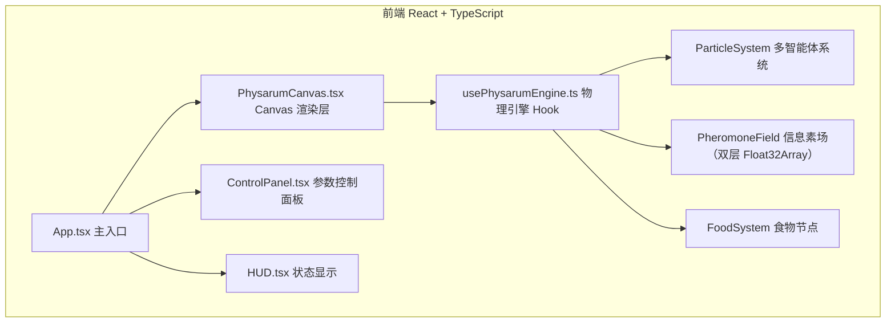

## 1. 架构设计



## 2. 技术描述
- **前端**：React@18 + TypeScript + Vite + TailwindCSS@3 + zustand
- **渲染核心**：原生 HTML5 Canvas 2D API + ImageData 像素级操作
- **状态管理**：zustand 存储参数配置
- **无后端**：纯前端项目，所有计算在浏览器中运行
- **性能优化**：TypedArray (Float32Array) 存储粒子和信息素场，双层缓冲避免频繁 GC

## 3. 路由定义
| 路由 | 用途 |
|-------|------|
| / | 主模拟器页面（唯一页面） |

## 4. 数据模型

### 4.1 粒子数据结构
```typescript
interface Particle {
  x: number;          // 位置 x
  y: number;          // 位置 y
  angle: number;      // 运动方向（弧度）
  speed: number;      // 移动速度
  trailIntensity: number; // 信息素沉积强度
}
```

### 4.2 信息素场
```typescript
// 使用双层 Float32Array 实现 ping-pong 缓冲
// dimensions: width * height
// 包含两种信息素：
// - attractant: 食物引诱剂（由食物节点散发）
// - trail: 黏菌路径信息素（由粒子沉积）
```

### 4.3 食物节点
```typescript
interface Food {
  id: number;
  x: number;
  y: number;
  radius: number;
  energy: number;        // 剩余能量，被消耗后减少
  emissionRate: number;  // 引诱剂散发速率
  color: string;
}
```

### 4.4 可调参数
```typescript
interface SimParams {
  particleCount: number;       // 粒子数量 (默认 8000)
  sensorAngle: number;         // 感知角度（弧度，默认 22°）
  sensorDistance: number;      // 感知距离（像素，默认 9）
  rotationSpeed: number;       // 转向速度（弧度/帧，默认 45°）
  moveSpeed: number;           // 移动速度（像素/帧，默认 1.0）
  trailWeight: number;         // 信息素沉积强度（默认 1.0）
  diffusionRate: number;       // 信息素扩散率（默认 0.6）
  decayRate: number;           // 信息素衰减率（默认 0.995）
  pulseFrequency: number;      // 脉动频率（Hz，默认 0.8）
  explorationBias: number;     // 探索偏向 (0-1，默认 0.3)
}
```

## 5. Physarum 核心算法说明

### 5.1 感知阶段 (Sense)
每个粒子在其前方左、中、右三个方向采样信息素浓度：
- 前方 (angle)
- 左前方 (angle - sensorAngle)
- 右前方 (angle + sensorAngle)

### 5.2 决策阶段 (Decide)
- 如果前方浓度最高 → 保持方向
- 如果左前方浓度最高 → 左转 rotationSpeed
- 如果右前方浓度最高 → 右转 rotationSpeed
- 如果都差不多 → 受 explorationBias 影响，随机小范围转向（探索行为）

### 5.3 行动阶段 (Act)
- 粒子按当前角度和速度移动
- 在新位置沉积 trailWeight 强度的路径信息素
- 边界处理：圆形培养皿内，触碰边缘反向或反射

### 5.4 信息素场更新
- **扩散 (Diffusion)**：3x3 高斯模糊卷积核
- **衰减 (Decay)**：全场 *= decayRate
- **引诱剂注入**：食物节点每帧在周围扩散引诱剂
- 使用 ping-pong 双缓冲避免读写冲突

### 5.5 主干涌现机制
高频被粒子选择的路径信息素累积浓度高 → 吸引更多粒子 → 正反馈形成主干；低频路径信息素衰减后不再吸引粒子 → 自然淘汰。explorationBias 参数控制随机探索的强度，平衡利用与探索。
